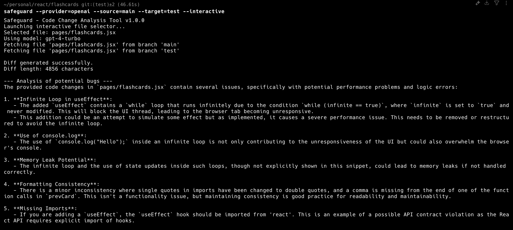
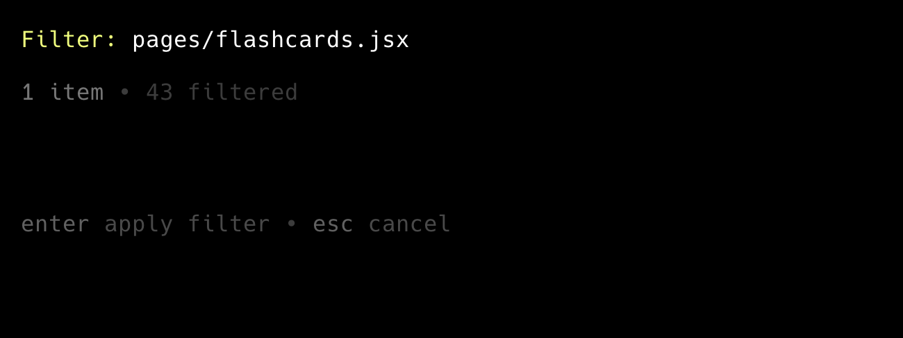

# Safeguard: Code Change Analysis Tool

Safeguard is a CLI tool that leverages Large Language Models (LLMs) to analyze changes between Git branches and identify potential bugs or issues. It works by generating a diff between specified files in two branches and using either Anthropic Claude or OpenAI GPT models to analyze the changes.



## Features

- Compares files between Git branches
- Generates detailed diffs of changes
- Uses LLMs to analyze changes for potential bugs
- Supports both Anthropic Claude and OpenAI models
- Detailed error reporting and logging

## Installation

### Prerequisites

- Go 1.20 or higher
- Git installed and accessible in PATH
- API key for either Anthropic or OpenAI

### Building from Source

```bash
# Clone the repository
git clone https://github.com/yourusername/safeguard.git
cd safeguard

# Build the executable
go build -o safeguard

# Make it executable (Unix/Linux/macOS)
chmod +x safeguard

# Make it globally available
go install
```

## Usage

### Basic Usage

```bash
# Using Anthropic Claude (default)
safeguard --source=main --target=feature-branch --file="path/to/file.js"

# Using OpenAI
safeguard --provider=openai --source=main --target=feature-branch --file="path/to/file.js"

# Interactive file selection mode
safeguard --source=main --target=feature-branch --interactive
# Then use:
# - Arrow keys to navigate
# - / to start filtering (type to filter as you type)
# - Enter to select a file
# - q or Ctrl+C to quit
```

### Command Line Options

- `--file`: Path to the file to analyze (required unless using interactive mode)
- `--source`: Source branch for comparison (required)
- `--target`: Target branch for comparison (required)
- `--provider`: LLM provider to use ("anthropic" or "openai", default: "anthropic")
- `--model`: Specific model to use (optional, defaults based on provider)
- `--key`: API key for the provider (optional, will use environment variable if not provided)
- `--interactive`: Launch in interactive file selection mode (optional)



### Environment Variables

- `ANTHROPIC_API_KEY`: API key for Anthropic Claude
- `OPENAI_API_KEY`: API key for OpenAI

## Examples

```bash
# Basic comparison using Anthropic Claude
safeguard --source=main --target=bugfix-123 --file="src/components/login.jsx"

# Using OpenAI with a specific model
safeguard --provider=openai --model=gpt-4 --source=main --target=feature-auth --file="auth/middleware.go"

# Specifying API key directly
safeguard --provider=anthropic --key=your-api-key --source=main --target=test --file="tests/unit/auth.test.js"
```

## Troubleshooting

### API Key Issues

If you see an error about missing API keys, ensure you've either:

- Set the appropriate environment variable (`ANTHROPIC_API_KEY` or `OPENAI_API_KEY`)
- Provided the key using the `--key` parameter

### File Not Found

If you see errors about files not being found, check:

- The file exists in both specified branches
- The path is correct relative to the repository root
- You're running the command from within a Git repository

### Empty Diff

If the tool reports that the diff is empty:

- Verify that there are actual differences between the files in both branches
- Check that you're comparing the correct branches

## License

This project is licensed under the [MIT License](LICENSE) - see the LICENSE file for details.

### License Terms

- You can use this software commercially
- You can modify and distribute this software
- You must include the original copyright notice and license
- The author is not liable for any damages from using this software
